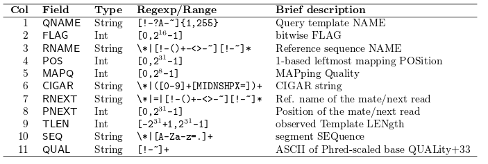

## <a name="align"></a> Alignment

- Locating where each generated sequence came from in the genome
- Outside the scope of this course
- *Usually* perfomed automatically by a sequencing service
- For most of what follows in the course, we will assume alignment has been performed and we are dealing with aligned data
    + Popular aligners
    + bwa http://bio-bwa.sourceforge.net/
    + bowtie http://bowtie-bio.sourceforge.net/index.shtml
    + novoalign http://www.novocraft.com/products/novoalign/
    + stampy http://www.well.ox.ac.uk/project-stampy
    + many, many more.....

## Aligned reads - sam

- **S**equence **A**lignment/**M**ap (sam) http://samtools.github.io/hts-specs/SAMv1.pdf
- *Header* lines followed by tab-delimited lines
    + Header gives information about the alignment and references sequences used
- Same format regardless of sequencing protocol (i.e. RNA-seq, ChIP-seq, DNA-seq etc)
- May contain un-mapped reads

```
@HD     VN:1.0  SO:coordinate
@SQ     SN:chr1 LN:249250621
@SQ     SN:chr10        LN:135534747
@SQ     SN:chr11        LN:135006516
```


```
HWI-ST1001:137:C12FPACXX:7:1115:14131:66670     0       chr1    12805   1       42M4I5M *
0       0       TTGGATGCCCCTCCACACCCTCTTGATCTTCCCTGTGATGTCACCAATATG     
CCCFFFFFHHGHHJJJJJHJJJJJJJJJJJJJJJJIJJJJJJJJJJJJIJJ     
AS:i:-28        XN:i:0  XM:i:2  XO:i:1XG:i:4   NM:i:6  MD:Z:2C41C2     YT:Z:UU NH:i:3  
CC:Z:chr15      CP:i:102518319  XS:A:+  HI:i:0

```

- http://homer.salk.edu/homer/basicTutorial/samfiles.html


- Large size on disk; ~100s of Gb
    + Can be manipulated with standard unix tools; e.g. *cat*, *head*, *grep*, *more*, *less*

## Sam format - key columns

```
HWI-ST1001:137:C12FPACXX:7:1115:14131:66670     0       chr1    12805   1       42M4I5M *
0       0       TTGGATGCCCCTCCACACCCTCTTGATCTTCCCTGTGATGTCACCAATATG     
CCCFFFFFHHGHHJJJJJHJJJJJJJJJJJJJJJJIJJJJJJJJJJJJIJJ     
AS:i:-28        XN:i:0  XM:i:2  XO:i:1XG:i:4   NM:i:6  MD:Z:2C41C2     YT:Z:UU NH:i:3  
CC:Z:chr15      CP:i:102518319  XS:A:+  HI:i:0

```



- http://samtools.github.io/hts-specs/SAMv1.pdf
    + Read name
    + Chromosome
    + Position
    + Mapping quality
    + etc...

## <a name="igv"></a> Viewing aligned reads in IGV

- Once our bam files have been *indexed* we can view them in IGV
- This is **highly recommended**
- Check-out [our colleagues' course](http://mrccsc.github.io/IGV_course/) for more details

    
    


## Aligned reads - bam

- *Exactly* the same information as a sam file
- ..except that it is *binary* version of sam
- compressed around x4
- Attempting to read will print garbage to the screen
- bam files can be indexed
    + Produces an index file with the same name as the bam file, but with **.bai** extension

```
samtools view mysequences.bam | head
```

- N.B The sequences can be extracted by various tools to give *fastq*


## Post-processing of aligned files

- PCR duplicates
    + Such reads are *marked* but not usually removed from the data
    + Most downstream methods will ignore such reads
    + Typically, [***picard***](http://broadinstitute.github.io/picard/) is used 
    
- Sorting
    + Reads can be sorted according to genomic position
        + [***samtools***](http://www.htslib.org/)
- Indexing
    + Allow efficient access
        + [***samtools***](http://www.htslib.org/)


## Post-processing of aligned files

- Marking of PCR duplicates
    + PCR amplification errors can cause some sequences to be over-represented
    + Chances of any two sequences aligning to the same position are *unlikely*
    + Caveat: obviously this depends on amount of the genome you are capturing

```{r echo=FALSE,cache=TRUE}
suppressPackageStartupMessages(library(GenomicAlignments))
mybam <- "HG00096.chr22.bam"
dupReads <- readGAlignments(file=mybam,param=ScanBamParam(scanBamFlag(isDuplicate = TRUE)))
nodupReads <- readGAlignments(file=mybam,param=ScanBamParam(scanBamFlag(isDuplicate = FALSE)))
suppressPackageStartupMessages(library(ggbio))
gr1 <- GRanges("22",IRanges(16448767,16448866))
gr1 <- flank(gr1, 10,both=TRUE)
dupReads <- dupReads[dupReads %over% gr1]
pcrDuplicate <- start(dupReads)==16448767 & end(dupReads) == 16448866
mcols(dupReads)$pcrDuplicate <- pcrDuplicate
autoplot(dupReads,aes(fill=pcrDuplicate)) + scale_fill_manual(values = c("black","red"))
```

    

## <a name="funwithflags"></a> Dr Mark Dunning presents 'Fun with Flags'

## Sam file flags

- Represent useful QC information
    + Read is unmapped
    + Read is paired / unpaired
    + Read failed QC
    + Read is a PCR duplicate (see later)


## Derivation

```{r echo=FALSE,cache=TRUE}
suppressPackageStartupMessages(library(GenomicAlignments))
mybam <- "HG00096.chr22.bam"
bam.extra <- readGAlignments(file=mybam,param=ScanBamParam(what=c("flag")))
flags <- mcols(bam.extra)$flag
flagMat <- bamFlagAsBitMatrix(flags)
df <- data.frame(ReadHasProperty = as.logical(flagMat[1,]),Binary=flagMat[1,] ,MultiplyBy=2^(0:10))
knitr::kable(df)
```

Value of flag is given by `r paste(df$Binary,df$MultiplyBy,sep="x",collapse=" + ")` = `r sum(df$Binary * t(df$MultiplyBy))`

See also

- https://broadinstitute.github.io/picard/explain-flags.html

## samtools flagstat

- Useful *command-line* tool as part of **samtools**

```
$ samtools flagstat NA19914.chr22.bam
2109857 + 0 in total (QC-passed reads + QC-failed reads)
0 + 0 secondary
0 + 0 supplimentary
40096 + 0 duplicates
2064356 + 0 mapped (97.84%:-nan%)
2011540 + 0 paired in sequencing
1005911 + 0 read1
1005629 + 0 read2
1903650 + 0 properly paired (94.64%:-nan%)
1920538 + 0 with itself and mate mapped
45501 + 0 singletons (2.26%:-nan%)
5134 + 0 with mate mapped to a different chr
4794 + 0 with mate mapped to a different chr (mapQ>=5)

```


```{r}
library(GenomicAlignments)
mybam <- readGAlignments("paired.bam")
mybam
```

How many reads have aligned to each chromosome

```{r}
table(seqnames(mybam))
```

```{r}
bam <- readGAlignments("paired.bam",param=ScanBamParam(what=c("seq","mapq","flag")),use.names = TRUE)
```


```{r}
mcols(bam)
hist(mcols(bam)$mapq)
```

```{r}
table(mcols(bam)$flag)
dupReads <- bam[mcols(bam)$flag==1024]

```

```{r}
flags <- mcols(bam)$flag
flagMat <- bamFlagAsBitMatrix(flags)
head(flagMat)
table(flagMat[,3])
```

```{r}
library(org.Hs.eg.db)
```

```{r}
columns(org.Hs.eg.db)
keytypes(org.Hs.eg.db)
```


```{r}
eg <- select(org.Hs.eg.db, keys="BRCA1", keytype = "SYMBOL",columns = "ENTREZID")
```

```{r}
library(TxDb.Hsapiens.UCSC.hg19.knownGene)
txdb <- TxDb.Hsapiens.UCSC.hg19.knownGene
columns(txdb)
keytypes(txdb)
```

```{r}
mygene <- select(txdb, keys="672", columns = c("EXONCHROM","EXONSTART","EXONEND","EXONSTRAND"),keytype="GENEID")
```


```{r}
allex <- exonsBy(txdb, "gene")
mygene <- allex[["672"]]
```

```{r}
seqlevelsStyle(mybam)
seqlevelsStyle(mygene)
seqlevelsStyle(mygene) <- "Ensembl"
mygene
```

```{r}
mybam <- keepSeqlevels(mybam, "17")
```


```{r}
mybam[mybam %over% mygene]
```

