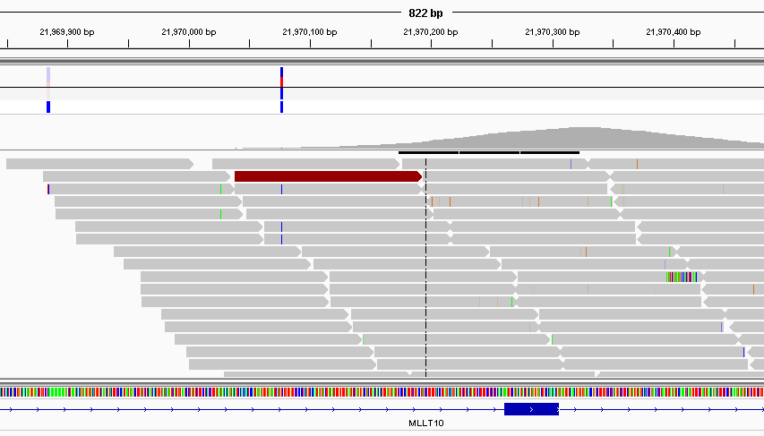

## <a name="align"></a> Alignment

- Locating where each generated sequence came from in the genome
- Outside the scope of this course
- *Usually* perfomed automatically by a sequencing service
- For most of what follows in the course, we will assume alignment has been performed and we are dealing with aligned data
    + Popular aligners
    + bwa http://bio-bwa.sourceforge.net/
    + bowtie http://bowtie-bio.sourceforge.net/index.shtml
    + novoalign http://www.novocraft.com/products/novoalign/
    + stampy http://www.well.ox.ac.uk/project-stampy
    + many, many more.....

## Aligned reads - sam

- **S**equence **A**lignment/**M**ap (sam) http://samtools.github.io/hts-specs/SAMv1.pdf
- *Header* lines followed by tab-delimited lines
    + Header gives information about the alignment and references sequences used
- Same format regardless of sequencing protocol (i.e. RNA-seq, ChIP-seq, DNA-seq etc)
- May contain un-mapped reads

```
@HD     VN:1.0  SO:coordinate
@SQ     SN:chr1 LN:249250621
@SQ     SN:chr10        LN:135534747
@SQ     SN:chr11        LN:135006516
```


```
HWI-ST1001:137:C12FPACXX:7:1115:14131:66670     0       chr1    12805   1       42M4I5M *
0       0       TTGGATGCCCCTCCACACCCTCTTGATCTTCCCTGTGATGTCACCAATATG     
CCCFFFFFHHGHHJJJJJHJJJJJJJJJJJJJJJJIJJJJJJJJJJJJIJJ     
AS:i:-28        XN:i:0  XM:i:2  XO:i:1XG:i:4   NM:i:6  MD:Z:2C41C2     YT:Z:UU NH:i:3  
CC:Z:chr15      CP:i:102518319  XS:A:+  HI:i:0

```

- http://homer.salk.edu/homer/basicTutorial/samfiles.html


- Large size on disk; ~100s of Gb
    + Can be manipulated with standard unix tools; e.g. *cat*, *head*, *grep*, *more*, *less*

## Sam format - key columns

```
HWI-ST1001:137:C12FPACXX:7:1115:14131:66670     0       chr1    12805   1       42M4I5M *
0       0       TTGGATGCCCCTCCACACCCTCTTGATCTTCCCTGTGATGTCACCAATATG     
CCCFFFFFHHGHHJJJJJHJJJJJJJJJJJJJJJJIJJJJJJJJJJJJIJJ     
AS:i:-28        XN:i:0  XM:i:2  XO:i:1XG:i:4   NM:i:6  MD:Z:2C41C2     YT:Z:UU NH:i:3  
CC:Z:chr15      CP:i:102518319  XS:A:+  HI:i:0

```


- http://samtools.github.io/hts-specs/SAMv1.pdf
    + Read name
    + Chromosome
    + Position
    + Mapping quality
    + etc...

## <a name="igv"></a> Viewing aligned reads in IGV

- Once our bam files have been *indexed* we can view them in IGV
- This is **highly recommended**
- Check-out [our colleagues' course](http://mrccsc.github.io/IGV_course/) for more details

    
    


## Aligned reads - bam

- *Exactly* the same information as a sam file
- ..except that it is *binary* version of sam
- compressed around x4
- Attempting to read will print garbage to the screen
- bam files can be indexed
    + Produces an index file with the same name as the bam file, but with **.bai** extension

```
samtools view mysequences.bam | head
```

- N.B The sequences can be extracted by various tools to give *fastq*


## Post-processing of aligned files

- PCR duplicates
    + Such reads are *marked* but not usually removed from the data
    + Most downstream methods will ignore such reads
    + Typically, [***picard***](http://broadinstitute.github.io/picard/) is used 
    
- Sorting
    + Reads can be sorted according to genomic position
        + [***samtools***](http://www.htslib.org/)
- Indexing
    + Allow efficient access
        + [***samtools***](http://www.htslib.org/)


## Post-processing of aligned files

- Marking of PCR duplicates
    + PCR amplification errors can cause some sequences to be over-represented
    + Chances of any two sequences aligning to the same position are *unlikely*
    + Caveat: obviously this depends on amount of the genome you are capturing

```{r echo=FALSE,cache=TRUE}
suppressPackageStartupMessages(library(GenomicAlignments))
mybam <- "paired.bam"
dupReads <- readGAlignments(file=mybam,param=ScanBamParam(scanBamFlag(isDuplicate = TRUE)))
#nodupReads <- readGAlignments(file=mybam,param=ScanBamParam(scanBamFlag(isDuplicate = FALSE)))
suppressPackageStartupMessages(library(ggbio))
tb <- table(start(dupReads))
maxstart <- as.numeric(names(tb)[which.max(tb)])
ends <- table(end(dupReads)[start(dupReads)==maxstart])
              
maxend <- as.numeric(names(which.max(ends)))

gr1 <- GRanges(seqnames(dupReads)[match(maxstart,start(dupReads))], IRanges(maxstart,maxend))
gr1 <- flank(gr1, 10,both=TRUE)
dupReads <- dupReads[dupReads %over% gr1]
pcrDuplicate <- start(dupReads)==maxstart & end(dupReads) == maxend
mcols(dupReads)$pcrDuplicate <- pcrDuplicate
autoplot(dupReads,aes(fill=pcrDuplicate)) + scale_fill_manual(values = c("black","red"))
```

    

## <a name="funwithflags"></a> Dr Mark Dunning presents 'Fun with Flags'

## Sam file flags

- Represent useful QC information
    + Read is unmapped
    + Read is paired / unpaired
    + Read failed QC
    + Read is a PCR duplicate (see later)


## Derivation

```{r echo=FALSE,cache=TRUE}
suppressPackageStartupMessages(library(GenomicAlignments))
mybam <- "paired.bam"
bam.extra <- readGAlignments(file=mybam,param=ScanBamParam(what=c("flag")))
flags <- mcols(bam.extra)$flag
flagMat <- bamFlagAsBitMatrix(flags)
df <- data.frame(ReadHasProperty = as.logical(flagMat[1,]),Binary=flagMat[1,] ,MultiplyBy=2^(0:10))
knitr::kable(df)
```

Value of flag is given by `r paste(df$Binary,df$MultiplyBy,sep="x",collapse=" + ")` = `r sum(df$Binary * t(df$MultiplyBy))`

See also

- https://broadinstitute.github.io/picard/explain-flags.html

## samtools flagstat

- Useful *command-line* tool as part of **samtools**

```
$ samtools flagstat NA19914.chr22.bam
2109857 + 0 in total (QC-passed reads + QC-failed reads)
0 + 0 secondary
0 + 0 supplimentary
40096 + 0 duplicates
2064356 + 0 mapped (97.84%:-nan%)
2011540 + 0 paired in sequencing
1005911 + 0 read1
1005629 + 0 read2
1903650 + 0 properly paired (94.64%:-nan%)
1920538 + 0 with itself and mate mapped
45501 + 0 singletons (2.26%:-nan%)
5134 + 0 with mate mapped to a different chr
4794 + 0 with mate mapped to a different chr (mapQ>=5)

```

# Processing with R and Bioconductor

To understand how to process aligned reads with Bioconductor, we need to introduce a key data-type.

## Core data-type 1: Genome Intervals

- A Genome is typically represented as linear sequence
- Ranges are an ordered set of consecutive integers defined by a start and end position
    + start $\le$ end
- Ranges are a common scaffold for many genomic analyses
- Ranges can be associated with genomic information (e.g. gene name) or data derived from analysis (e.g. counts)
- The `IRanges` package in Bioconductor allows us to work with intervals
    + one of the aims of Bioconductor is to encourage core object-types and functions
    + `IRanges` is an example of this

## IRanges is crucial for many packages

Just some of the packages that *depend* on [IRanges](http://bioconductor.org/packages/release/bioc/html/IRanges.html)


## IRanges paper


## Example

Suppose we want to capture information on the following intervals

```{r echo=FALSE,message=FALSE}
library(ggbio)
ir <- IRanges(start = c(7,9,12,14,22:24), 
              end=c(15,11,13,18,26,27,28))
pl <- autoplot(ir,fill=brewer.pal(n=length(ir),"Set1"))+ geom_vline(x=seq(1,40,by=1),lty=2)
library(gridExtra)
pl
```

## Creating the object

- The `IRanges` function from the `IRanges` package is used to *construct* a new object
    + think `data.frame`, `vector` or `matrix` 
    + it's structure is quite unlike anything we've seen before
    
```{r}
library(IRanges)
ir <- IRanges(
start = c(7,9,12,14,22:24), 
end=c(15,11,13,18,26,27,28))
str(ir)
```

## Display the object

- Typing the name of the object will print a summary of the object to the screen
    + useful compared to display methods for data frames, which print the whole object
- the square brackets `[]` should give a hint about how to access the data...

```{r}
ir
```

## Adding metadata

We can give our ranges names
```{r}
ir <- IRanges(
start = c(7,9,12,14,22:24), 
end=c(15,11,13,18,26,27,28),names=LETTERS[1:7])
ir
```


## Ranges as vectors
- `IRanges` can be treated as if they were *vectors*
    + no new rules to learn
        + if we can subset vectors, we can subset ranges
    + vector operations are efficient
    + Remember, square brackets `[` to subset
    + Inside the brackets, put a numeric vector to specify the `indices` that you want values for
        + e.g. get the first two intervals in the object using the `:` shortcut

```{r}
ir[1:2]
ir[c(2,4,6)]
```

## Accessing the object
- If we want to extract the properties of the object, the package authors have provided some useful functions
    + we call these *accessor* functions
    + We don't need to know the details of how the objects and implemented to access the data
    + the authors are free to change the implementation at any time
        + we shouldn't notice the difference
    + the result is a vector with the same length as the number of intervals
        
```{r}
start(ir)
end(ir)
width(ir)
```

## More-complex subsetting
- Recall that '*logical*' vectors can be used in subsetting
    + i.e. `TRUE` or `FALSE`
- Such a vector can be derived using a comparison operator
    + `<`, `>`, `==`

```{r}
width(ir) == 5
ir[width(ir)==5]
```


## More-complex subsetting

- Multiple logical vectors can be combined using `&` (and), `|` (or)
    + eg intervals that start after 10, **and** before 27
    
```{r}
ir[end(ir) < 27]
ir[start(ir) > 10 & end(ir) < 27]

```


# Manipulating Ranges

## Lots of common use-cases are implemented


## Shifting
e.g. sliding windows

```{r}
ir
shift(ir, 5)
```

## Shifting


```{r echo=FALSE}
p2 <- autoplot(shift(ir,5),fill=brewer.pal(n=length(ir),"Set1")) +geom_vline(x=seq(1,40,by=1),lty=2)
tracks(pl, p2)
```

## Shifting

Size of shift doesn’t need to be constant

```{r}
ir
shift(ir, 7:1)
```

## Shifting

```{r echo=FALSE}
p2 <- autoplot(shift(ir,7:1),fill=brewer.pal(n=length(ir),"Set1"))+geom_vline(x=seq(1,40,by=1),lty=2)
tracks(pl, p2)
```

## Resize

e.g. trimming reads

```{r}
ir
resize(ir,3)
```
## Resize

```{r echo=FALSE}
p2 <- autoplot(resize(ir,3),fill=brewer.pal(n=length(ir),"Set1")) + geom_vline(x=seq(1,40,by=1),lty=2)
tracks(pl, p2)
```


## Coverage

- Often we want to know how much sequencing we have at particular positions
    + i.e. depth of coverage

`coverage` returns a *Run Length Encoding* - an efficient representation of repeated values

```{r}
cvg <- coverage(ir)
cvg
as.vector(cvg)

```

## Coverage Results

```{r echo=FALSE}
p2 <- autoplot(coverage(ir),binwidth=1) + ggtitle("Coverage")
tracks(pl,p2)
```

## Overlapping
e.g. counting
- The terminology of overlapping defines a *query* and a *subject*


## Overlaps

- lets start be defining a new set of ranges

```{r}
ir3 <- IRanges(start = c(1, 14, 27), end = c(13,
    18, 30),names=c("X","Y","Z"))
ir3

```
## Overlaps

```{r echo=FALSE}
p2 <- autoplot(ir3)
tracks(pl,p2)

```


## Overlaps


- The `findOverlaps` function is used for overlap
    + the output isn't immediately obvious
    + length of output is the number of *hits*
        + each hit is defined by a subject and query index
    + require accessor functions to get the data; `queryHits` and `subjectHits`
    
```{r}
query <- ir
subject <- ir3
ov <- findOverlaps(query, subject)
ov
```

## queryHits and subjectHits

- `queryHits` returns *indices* from the ***query***
    + each query may overlap with many in the subject
```{r}
queryHits(ov)
```
- `subjectHits` returns *indices* from the ***subject***
    + each subject range may overlap with many in the query    
```{r}
subjectHits(ov)
```
- e.g. `r queryHits(ov)[1]` from the query overlaps with `r subjectHits(ov)[1]` from the subject

##Overlap example - First hit
    
    
```{r}
query[queryHits(ov)[1]]
subject[subjectHits(ov)[1]]
```


```{r echo=FALSE, fig.height=3}
fll <- rep("white", length(ir))
fll[queryHits(ov)[1]] <- "black"

qplot <- autoplot(ir,fill=fll)+geom_vline(x=seq(1,40,by=1),lty=2) + ggtitle("Query")

fll <- rep("white", length(ir3))
fll[subjectHits(ov)[1]] <- "black"

subplot <- autoplot(ir3,fill=fll) +geom_vline(x=seq(1,40,by=1),lty=2) + ggtitle("Subject")
tracks(qplot, subplot,main="Query (above) and Subject (below)")  
```

## Overlap example - Second hit

```{r}
query[queryHits(ov)[2]]
subject[subjectHits(ov)[2]]
```


```{r echo=FALSE,fig.height=3}
fll <- rep("white", length(ir))
fll[queryHits(ov)[2]] <- "black"

qplot <- autoplot(ir,fill=fll)+ geom_vline(x=seq(1,40,by=1),lty=2,main="Query") + ggtitle("Query")

fll <- rep("white", length(ir3))
fll[subjectHits(ov)[2]] <- "black"

subplot <- autoplot(ir3,fill=fll) +geom_vline(x=seq(1,40,by=1),lty=2,main="Subject") + ggtitle("Subject")
tracks(qplot, subplot,main="Query (above) and Subject (below)")  
```

## Overlap example - Third hit

```{r}
query[queryHits(ov)[3]]
subject[subjectHits(ov)[3]]
```


```{r echo=FALSE,fig.height=3}
fll <- rep("white", length(ir))
fll[queryHits(ov)[3]] <- "black"

qplot <- autoplot(ir,fill=fll)+ geom_vline(x=seq(1,40,by=1),lty=2,main="Query") + ggtitle("Query")

fll <- rep("white", length(ir3))
fll[subjectHits(ov)[3]] <- "black"

subplot <- autoplot(ir3,fill=fll) +geom_vline(x=seq(1,40,by=1),lty=2,main="Subject") + ggtitle("Subject")
tracks(qplot, subplot,main="Query (above) and Subject (below)")  
```


## Counting

- If we just wanted to count the number of overlaps for each range, we can use `countOverlaps`
    + result is a vector with length the number of intervals in query
    + e.g. interval 1 in the query overlaps with `r countOverlaps(query,subject)[1]` intervals in the subject
    
```{r}
countOverlaps(query,subject)
```
- Order of arguments is important
```{r}
countOverlaps(subject,query)
```


## Intersection

- Rather than counting, we might want to know which positions are in common
```{r}
intersect(ir,ir3)

```

```{r echo=FALSE}
pl2 <- autoplot(ir3)
p2 <- autoplot(intersect(ir,ir3))
tracks(pl,pl2,p2)

```

## Subtraction

- Or which positions are missing

```{r}
setdiff(ir,ir3)

```

```{r echo=FALSE}
p2 <- autoplot(setdiff(ir,ir3))
tracks(pl,pl2,p2)

```


```{r}
library(GenomicAlignments)
mybam <- readGAlignments("paired.bam")
mybam
```

How many reads have aligned to each chromosome

```{r}
table(seqnames(mybam))
```

```{r}
bam <- readGAlignments("paired.bam",param=ScanBamParam(what=c("seq","mapq","flag")),use.names = TRUE)
```


```{r}
mcols(bam)
hist(mcols(bam)$mapq)
```

```{r}
table(mcols(bam)$flag)
dupReads <- bam[mcols(bam)$flag==1024]

```

```{r}
flags <- mcols(bam)$flag
flagMat <- bamFlagAsBitMatrix(flags)
head(flagMat)
table(flagMat[,3])
```

```{r}
library(org.Hs.eg.db)
```

```{r}
columns(org.Hs.eg.db)
keytypes(org.Hs.eg.db)
```


```{r}
eg <- select(org.Hs.eg.db, keys="BRCA1", keytype = "SYMBOL",columns = "ENTREZID")
```

```{r}
library(TxDb.Hsapiens.UCSC.hg19.knownGene)
txdb <- TxDb.Hsapiens.UCSC.hg19.knownGene
columns(txdb)
keytypes(txdb)
```

```{r}
mygene <- select(txdb, keys="672", columns = c("EXONCHROM","EXONSTART","EXONEND","EXONSTRAND"),keytype="GENEID")
```


```{r}
allex <- exonsBy(txdb, "gene")
mygene <- allex[["672"]]
```

```{r}
seqlevelsStyle(mybam)
seqlevelsStyle(mygene)
seqlevelsStyle(mygene) <- "Ensembl"
mygene
```

```{r}
mybam <- keepSeqlevels(mybam, "17")
```


```{r}
mybam[mybam %over% mygene]
```

