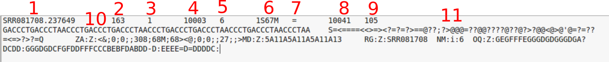
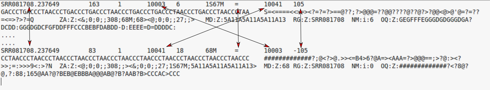

# Understanding file formats for aligned reads

Unlike most of Bioinfomatics, a *single standard* file format has emerged for aligned reads. Moreoever, this file format is consistent regardless of whether you have DNA-seq, RNA-seq, ChIP-seq... data. 


## The `.sam` file

- **S**equence **A**lignment/**M**ap (sam) 
- The output from an aligner such as `bwa`
- Same format regardless of sequencing protocol (i.e. RNA-seq, ChIP-seq, DNA-seq etc)
- May contain un-mapped reads
- Potentially large size on disk; ~100s of Gb
    + Can be manipulated with standard unix tools; e.g. *cat*, *head*, *grep*, *more*, *less*....
- Official specification can be [obtained online](http://samtools.github.io/hts-specs/SAMv1.pdf): -
- We normally work on a compressed version called a `.bam` file. See later.
- *Header* lines starting with an `@` character, followed by tab-delimited lines
    + Header gives information about the alignment and references sequences used


The first part of the header lists the names (`SN`) of the sequences (chromosomes) used in alignment, their length (`LN`) and a *md5sum* "[digital fingerprint](https://en.wikipedia.org/wiki/Md5sum)" of the `.fasta` file used for alignment (`M5`).

```
@HD	VN:1.5	SO:coordinate	GO:none
@SQ	SN:1	LN:249250621	M5:1b22b98cdeb4a9304cb5d48026a85128
@SQ	SN:2	LN:243199373	M5:a0d9851da00400dec1098a9255ac712e
@SQ	SN:3	LN:198022430	M5:fdfd811849cc2fadebc929bb925902e5
@SQ	SN:4	LN:191154276	M5:23dccd106897542ad87d2765d28a19a1
.....
.....

```

Next we can define the *read groups* present in the file which we can use to identify which sequencing library, sequencing centre, Lane, sample name etc.

```
@RG	ID:SRR077850	CN:bi	LB:Solexa-42057	PL:illumina	PU:ILLUMINA	SM:NA06984
@RG	ID:SRR081675	CN:bi	LB:Solexa-42316	PL:illumina	PU:ILLUMINA	SM:NA06984
@RG	ID:SRR080818	CN:bi	LB:Solexa-44770	PL:illumina	PU:ILLUMINA	SM:NA06984
@RG	ID:SRR084838	CN:bi	LB:Solexa-42316	PL:illumina	PU:ILLUMINA	SM:NA06984
@RG	ID:SRR081730	CN:bi	LB:Solexa-42316	PL:illumina	PU:ILLUMINA	SM:NA06984
.....
.....

```

Finally, we have a section where we can record the processing steps used to derive the file
```
@PG	ID:MosaikAligner	CL:/share/home/wardag/programs/MOSAIK/bin/MosaikAligner -in /scratch/wardag/NA06984.SRR077850.mapped.illumina.mosaik.CEU.SINGLE.20111114/NA06984.SRR077850.mapped.illumina.mosaik.CEU.SINGLE.20111114.mkb -out
....
....

```

Next is a *tab-delimited* section that describes the alignment of each sequence in detail. 

```
SRR081708.237649	163	1	10003	6	1S67M	=	10041	105	GACCCTGACCCTAACCCTGACCCTGACCCTAACCCTGACCCTGACCCTAACCCTGACCCTAACCCTAA	S=<====<<>=><?=?=?>==@??;?>@@@=??@@????@??@?>?@@<@>@'@=?=??=<=>?>?=Q	ZA:Z:<&;0;0;;308;68M;68><@;0;0;;27;;>MD:Z:5A11A5A11A5A11A13	RG:Z:SRR081708	NM:i:6	OQ:Z:GEGFFFEGGGDGDGGGDGA?DCDD:GGGDGDCFGFDDFFFCCCBEBFDABDD-D:EEEE=D=DDDDC:

```



Column | Official Name | Brief
------ | -------------- | -----------
1      | QNAME          | Sequence ID
2      | FLAG           | Sequence quality expressed as a bitwise flag
3      | RNAME          | Chromosome
4      | POS            | Start Position
5      | MAPQ           | Mapping Quality
6      | CIGAR          | Describes positions of matches, insertions, deletions w.r.t reference
7      | RNEXT          | Ref. name of mate / next read
8      | PNEXT          | Postion of mate / next read
9      | TLEN           | Observed Template length
10     | SEQ            | Sequence
11     | QUAL           | Base Qualities

There can also be all manner of optional tags as extra columns introduce by an aligner or downstream analysis tool. A common use is the `RG` tag which refers back to the read groups in the header.

Unlike the `.fastq` files, where we had a separate file for forward and reverse reads, the `.sam` file contains all reads. Reads that are paired with each other should appear in consecutive lines in the `.sam` file generated by an aligner. Otherwise it is more common for the file to be sorted according to genomic coordinates. The paired reads should share the same sequence ID in the first column (sometimes with a `/1` or `/2` to indicate which is which).




## Dr Mark Dunning presents....Fun with flags!

The *"flags"* in the sam file can represent useful QC information

  + Read is unmapped
  + Read is paired / unpaired
  + Read failed QC
  + Read is a PCR duplicate (see later)

The combination of any of these properties is used to derive a numeric value

```{r echo=FALSE,message=FALSE,warning=FALSE}
library(GenomicAlignments)
mybam <- "paired.bam"
gr <- GRanges("1", IRanges(10000,15000))
bam.extra <- readGAlignments(file=mybam,param=ScanBamParam(what=c("flag"),which=gr),use.names = TRUE)
```


For instance, a particular read has a flag of 163


### Derivation

There is a set of properties that a read can possess. If a particular property is observed, a corresponding power of 2 is added multiplied by 1. The final value is derived by summing all the powers of 2.

```{r echo=FALSE,warning=FALSE,message=FALSE}
suppressPackageStartupMessages(library(GenomicAlignments))
mybam <- "paired.bam"
bam.extra <- readGAlignments(file=mybam,param=ScanBamParam(what=c("flag"),which=gr),use.names = TRUE)
flags <- mcols(bam.extra)$flag
flagMat <- bamFlagAsBitMatrix(flags)
df <- data.frame(ReadHasProperty = as.logical(flagMat[1,]),Binary=flagMat[1,] ,MultiplyBy=2^(0:10))
knitr::kable(df)
```

Value of flag is given by `r paste(df$Binary,df$MultiplyBy,sep="x",collapse=" + ")` = `r sum(df$Binary * t(df$MultiplyBy))`

See also

- https://broadinstitute.github.io/picard/explain-flags.html

## Come in here, dear boy, have a CIGAR!

(we are in the home of Pink Floyd after all....)


The ***CIGAR*** (**C**ompact **I**diosyncratic **G**apped **Alignment** **R**eport) string is a way of encoding the match between a given sequence and the position it has been assigned in the genome. It is comprised by a series of letters and numbers to indicate how many consecutive bases have that mapping.


 
 Code  | Description
------------- | -------------
M  | alignment match
I  | insertion
D  | deletion
N  | skipped
S  | soft-clipping
H  | hard-clipping


e.g.

- `68M`
    + 68 bases matching the reference
- `1S67M`
    + 1 soft-clipped read followed by 67 matches
- `15M87N70M90N16M`
    + 15 matches following by 87 bases skipped followed by 70 matches etc.

Rather than dealing with `.sam` files, we usually analyse a `.bam` file.
 
## samtools

If you want to try any of these commands, click the link to the ***CRUK Docker*** on the Desktop

`samtools` is one of the most-popular ngs-related software suites and has a wealth of tools for dealing with files in `.bam` and `.sam` format. If you are going to start processing your own data, the chances are you'll be using `samtools` a lot. Typing `samtools` in a terminal will give a quick overview of the functions available, and importantly, the version number of the software.


```{}
samtools 
```

More information about a particular command within samtools can be displayed by printing `samtools` followed by the name of the command. For example, the `samtools view` command can convert a `.sam` file into a compressed version called a `.bam` file. This is a very-common step in an NGS workflow.

Lets assume we have a file `sample.sam` which is the result of aligning reads using a tool such as `bwa`. Then the command to convert would be:-

```{}
samtools view -bS sample.sam > sample.bam
```

```{}
-b: output a bam file
-S: input is a sam file
> : redirect to a file
```


So a `.bam` file is

- *Exactly* the same information as a sam file
- ..except that it is *binary* version of sam
- compressed around x4
- However, attempting to read with standard unix tools `cat`, `head` etc will print garbage to the screen

When viewing a `.sam` or `.bam`, we can choose to just view the *header* information

```{}
samtools view -H paired.bam
```

The `samtools view` command needs to be used with a bit of care if not selecting the `-H` option. Unless directed otherwise, `samtools` will print the entire contents of the file to the screen ("the standard output"). We usually "*pipe*" the output to another unix command, such as `head`

```{}
samtools view paired.bam | head
```

Alternative, we can print the reads within a specific region. There are also options to print reads with particular *flags*.

```{}
samtools view 1:1-100000 paired.bam
```

### Other useful samtools commands

```{}
samtools sort
```


- Sorting
    + The reads in a newly-aligned `.sam` file will probably be sorted according to the order they were generated by the sequencer
    + Reads can be sorted according to genomic position
    + Which allows us to access the file more easily
    
```{}
samtools index
```


- Indexing
    + Allow efficient access
    + Producing a file `.bai` in the same directory

```{}
samtools flagstat
```

- Collates quality control information from the *"flags"*

```
$ samtools flagstat paired.bam
12581680 + 0 in total (QC-passed reads + QC-failed reads)
177715 + 0 duplicates
12581680 + 0 mapped (100.00%:-nan%)
12581680 + 0 paired in sequencing
6291126 + 0 read1
6290554 + 0 read2
12581680 + 0 properly paired (100.00%:-nan%)
12581680 + 0 with itself and mate mapped
0 + 0 singletons (0.00%:-nan%)
0 + 0 with mate mapped to a different chr
0 + 0 with mate mapped to a different chr (mapQ>=5)
```

Typically, you will be dealing with `.bam` files that are

- indexed
- sorted
- have had *PCR duplicates* marked


## About PCR duplicates...

- Marking of PCR duplicates
    + PCR amplification errors can cause some sequences to be over-represented
    + Chances of any two sequences aligning to the same position are *unlikely*
    + Caveat: obviously this depends on amount of the genome you are capturing

```{r echo=FALSE,message=FALSE,warning=FALSE}
suppressPackageStartupMessages(library(GenomicAlignments))
mybam <- "paired.bam"
gr <- GRanges("1",IRanges(1,536870912))
dupReads <- readGAlignments(file=mybam,param=ScanBamParam(scanBamFlag(isDuplicate = TRUE),which=gr))
#nodupReads <- readGAlignments(file=mybam,param=ScanBamParam(scanBamFlag(isDuplicate = FALSE)))
suppressPackageStartupMessages(library(ggbio))
tb <- table(start(dupReads))
maxstart <- as.numeric(names(tb)[which.max(tb)])
ends <- table(end(dupReads)[start(dupReads)==maxstart])
              
maxend <- as.numeric(names(which.max(ends)))

gr1 <- GRanges(seqnames(dupReads)[match(maxstart,start(dupReads))], IRanges(maxstart,maxend))
gr1 <- flank(gr1, 10,both=TRUE)
dupReads <- dupReads[dupReads %over% gr1]
pcrDuplicate <- start(dupReads)==maxstart & end(dupReads) == maxend
mcols(dupReads)$pcrDuplicate <- pcrDuplicate
autoplot(dupReads,aes(fill=pcrDuplicate)) + scale_fill_manual(values = c("black","red"))
```

- Such reads are *marked* but not usually removed from the data
- Most downstream methods will ignore such reads
- Typically, [***picard***](http://broadinstitute.github.io/picard/) is used 

Picard is another very-common tool in NGS analysis with lots of conversion, manipulation tools. If you are seriously considering getting into NGS analysis, it is worth getting to know.

```{}
java -jar $PICARD -h
```

Here, `$PICARD` refers to the location that `PICARD` is installed within the CRUK Docker

# Summary

- `.sam` and `.bam` files are a consistent way of representing alignment to the genome
- They look the same regardless of the type of experiment
- For each read, we have lots of useful information about how reliable the mapping might be
    + the flag; https://broadinstitute.github.io/picard/explain-flags.html
    + the CIGAR
- We can utilise this information in our analyses
- The easiest way to actually *"see"* the reads is using a browser such as IGV, as we will see in the next section.

# References:-

- http://genome.sph.umich.edu/wiki/SAM
- http://davetang.org/wiki/tiki-index.php?page=SAM
- http://samtools.github.io/hts-specs/SAMv1.pdf