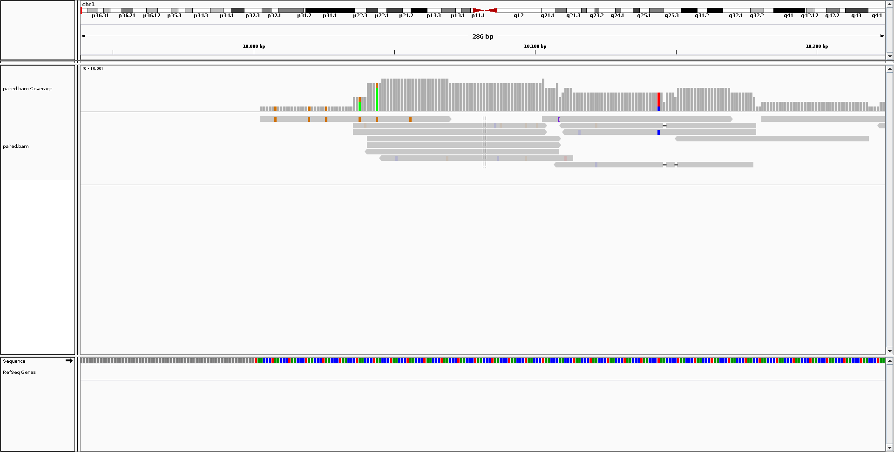
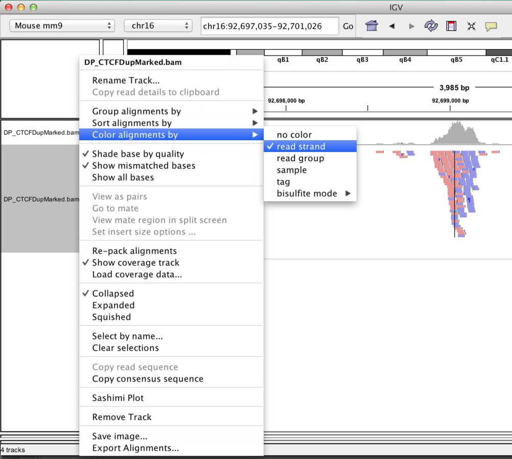

## Introducing the IGV Browser

Arguably the most-important tool you will learn about in this course is [IGV](https://www.broadinstitute.org/igv/). Whilst tools like R are very powerful and allow you to perform statistical analyses and test hypotheses, there is no substitute for ***looking at the data***. A trained-eye can quite quickly get a sense of the data quality before any computational analyses have been run. Futhermore, as the person requesting the sequencing, you probably know a lot about the biological context of the samples and what to expect. 

Many of the exercises in the course will use IGV, so you will have plenty of time to practice.

## Introduction

- IGV has been developed by the Broad Institute and is able to display most kinds of genomic data
    + expression
    + ChIP
    + whole-genome resequencing
    + shRNA
- It is a *Java* desktop application and can be run either locally of from the Broad website
    + You have a link to IGV on the taskbar on the left the screen in-front of you
- To run IGV yourself you will need to agree to the license and [download the version for your OS](http://www.broadinstitute.org/software/igv/download)

## A quick tour of IGV

Full set of slides from [MRC Clinical Sciences Centre](http://mrccsc.github.io/IGV_course/igv.html#/)


1) Sample information panel
    - Information about samples you have loaded
    - e.g. Sample ID, Gender, Age, Tumour / Normal
    
2) Genome Navigation panel
    - Jump to a genomic region in `Chr:Start-End` format
    - Jump to a gene symbol of interest
    
3) Data panel
    - Your sequencing reads will be displayed here
    - Or whatever data you have loaded
        + see information on [accepted file formats](http://www.broadinstitute.org/software/igv/RecommendedFileFormats)

4) Attribute panel
    - Gene locations
    - Genome sequence (if zoomed-in at appropriate level)
    - Proteins
    
## Example

Go to ***File*** -> ***Load from file*** and select `/home/participant/Course_Materials/data/test/paired.bam`. Note that the file `paired.bam.bai` needs to be present in the same directory. However, you only need to click on the `.bam`

- Make sure that `hg19` is selected from the Genome drop-down menu (top left)
- Type `chr1:9,939-10,224` in the Genome Navigation panel (***2***) to navigate to the start of chromosome 1; 




- The black dotted vertical lines indicates the centre of the view
- Each of the grey pointed rectangles represents a sequencing reads
    + whether the pointed bit is on the left or right indicates if the read is forward or reverse.
- A coverage track is also generated
- You should see the read that we described in detail in the previous section by *hover*ing over the reads to display the information from the `.bam` file

```
SRR081708.237649	163	1	10003	6	1S67M	=	10041	105	GACCCTGACCCTAACCCTGACCCTGACCCTAACCCTGACCCTGACCCTAACCCTGACCCTAACCCTAA	S=<====<<>=><?=?=?>==@??;?>@@@=??@@????@??@?>?@@<@>@'@=?=??=<=>?>?=Q	ZA:Z:<&;0;0;;308;68M;68><@;0;0;;27;;>MD:Z:5A11A5A11A5A11A13	RG:Z:SRR081708	NM:i:6	OQ:Z:GEGFFFEGGGDGDGGGDGA?DCDD:GGGDGDCFGFDDFFFCCCBEBFDABDD-D:EEEE=D=DDDDC:

```


- Why does the read have orange rectangles inside it?
    + zoom-in to see why
    + zoom using the `+` symbol in the to-right corner

- You can right-click on our read of interest and select "Go to Mate".
    + this should cause the paired-read to be highlighted on the screen
    + notice how it points in the other direction

The view in IGV is not static and we can scroll-along the genome by holding-down the left mouse in the data panel and dragging left and right

## Things to practice

- Scrolling left and right along the genome
    + what is the name of the first gene you come across?
- Zooming-in and out
- Also try jumping to your favourite gene by typing its name in the location box

## Viewing preferences

IGV allows us to configure many aspects of the data display

***Menu:-*** ***View -> Alignments***


It's worth noting that the display settings may be showing fewer reads than you have (*downsampling*) in order to conserve memory. Also, some QC-fail or PCR duplicates may be filtered.



We also have some options on how to display the reads themselves, which we can acccess by right-clicking on the bam track

Sorting alignments by:-

  - start
  - strand
  - base
  - mapping quality
  - insert size
  
The reads themselves can also be coloured according to

  - insert size
  - read strand
  - sample

We will re-visit these options later when we come to examine particular variant calls