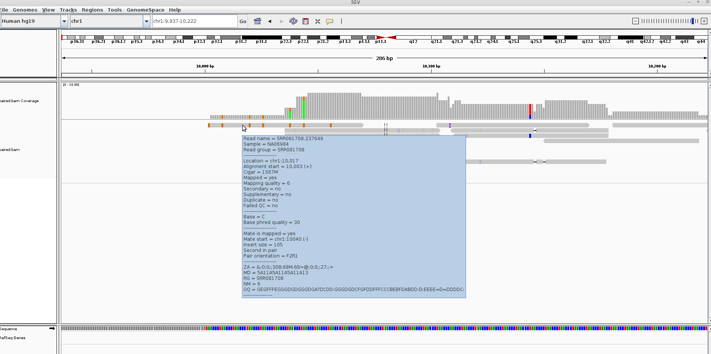

## Introducing the IGV Browser

Arguably the most-important tool you will learn about in this course is [IGV](https://www.broadinstitute.org/igv/). Whilst tools like R are very powerful and allow you to perform statistical analyses and test hypotheses, there is no substitute for ***looking at the data***. A trained-eye can quite quickly get a sense of the data quality before any computational analyses have been run. Futhermore, as the person requesting the sequencing, you probably know a lot about the biological context of the samples and what to expect. 

Many of the exercises in the course will use IGV, so you will have plenty of time to practice.

## Introduction

- IGV has been developed by the Broad Institute and is able to display most kinds of genomic data
    + expression
    + ChIP
    + whole-genome resequencing
    + shRNA
- It is a *Java* desktop application and can be run either locally of from the Broad website
    + You have a link to IGV on the taskbar on the left the screen in-front of you
- To run IGV yourself you will need to agree to the license and [download the version for your OS](http://www.broadinstitute.org/software/igv/download)

## A quick tour of IGV
For more details

- Full set of slides from [MRC Clinical Sciences Centre](http://mrccsc.github.io/IGV_course/igv.html#/)
- IGV tutorial from the [Griffth lab - WashU](https://github.com/griffithlab/rnaseq_tutorial/wiki/IGV-Tutorial)

1) Sample information panel
    - Information about samples you have loaded
    - e.g. Sample ID, Gender, Age, Tumour / Normal
    
2) Genome Navigation panel
    - Jump to a genomic region in `Chr:Start-End` format
    - Jump to a gene symbol of interest
    
3) Data panel
    - Your sequencing reads will be displayed here
    - Or whatever data you have loaded
        + see information on [accepted file formats](http://www.broadinstitute.org/software/igv/RecommendedFileFormats)

4) Attribute panel
    - Gene locations
    - Genome sequence (if zoomed-in at appropriate level)
    - Proteins
    
## Example

Go to ***File*** -> ***Load from file*** and select `/data/test/paired.bam`. Note that the file `paired.bam.bai` needs to be present in the same directory. However, you only need to click on the `.bam`

- Make sure that `hg19` is selected from the Genome drop-down menu (top left)
- Type `chr1:9,939-10,224` in the Genome Navigation panel (***2***) to navigate to the start of chromosome 1; 

- The black dotted vertical lines indicates the centre of the view
- Each of the grey pointed rectangles represents a sequencing reads
    + whether the pointed bit is on the left or right indicates if the read is forward or reverse.
- A coverage track is also generated
- You should see the read that we described in detail in the previous section by *hover*ing over the reads to display the information from the `.bam` file

- What do the coloured rectangles inside the read represent?
    + zoom-in to the base resolution
    + zoom using the `+` symbol in the to-right corner
    + perhaps right-click on the sequencing data track and un-tick `Shade base by quality`

- You can also right-click on a read of interest and select "Go to Mate".

The view in IGV is not static and we can scroll-along the genome by holding-down the left mouse in the data panel and dragging left and right

## Things to practice

- Scrolling left and right along the genome
    + what is the name of the first gene you come across?
- Zooming-in and out
- Also try jumping to your favourite gene by typing its name in the location box

## Viewing preferences

IGV allows us to configure many aspects of the data display

***Menu:-*** ***View -> Alignments***

It's worth noting that the display settings may be showing fewer reads than you have (*downsampling*) in order to conserve memory. Also, some QC-fail or PCR duplicates may be filtered.

We also have some options on how to display the reads themselves, which we can acccess by right-clicking on the bam track

Sorting alignments by:-

  - start
  - strand
  - base
  - mapping quality
  - insert size
  
The reads themselves can also be coloured according to

  - insert size
  - read strand
  - sample

Experiment with the various settings by right clicking the read alignment track and toggling the options. Think about which would be best for specific tasks (e.g. quality control, SNP calling, CNV finding). We will re-visit these options later when we come to examine particular variant calls

## Additional data tracks

Additional data tracks are also available on the IGV server. These include useful genome annotation tracks, such as:-

- GC percentage
- CpG islands
- Repeat regions
- dbSNP calls

You can try this now:-

`File` > `Load from Server...`

## Bookmarks and screenshots

It can be really useful to bookmark particular regions of interest that you have identified, in case you want to go back to them after some time. If you want to bookmark the region currently being displayed, click `Regions` > `Region Navigator`. You will then have the option to `Add` that region as a bookmark

- Go to BRCA1
- `Region` > `Region Navigator`
- Click `Add`
- Type a description by clicking in the `Description` box
- Now navigate elsewhere; say `BRCA2` if you can't think of anywhere
- `Region` > `Region Navigator` now should have `BRCA1` listed as a region. Click `View` to go back to it

There are a couple of neat features associated with saved regions, which you can access by right-clicked on the red rectangle that appears. We can copy the genome sequence to the clipboard and also BLAT the sequence

*N.B.* There is also a `Define a region of interest button` (5th button on right from the genome location bar) that will allow you to define the start and end of the region

Screenshots can be taken at any point with the `File` > `Save Image` option. The screenshot is saved as a `png` file. 
