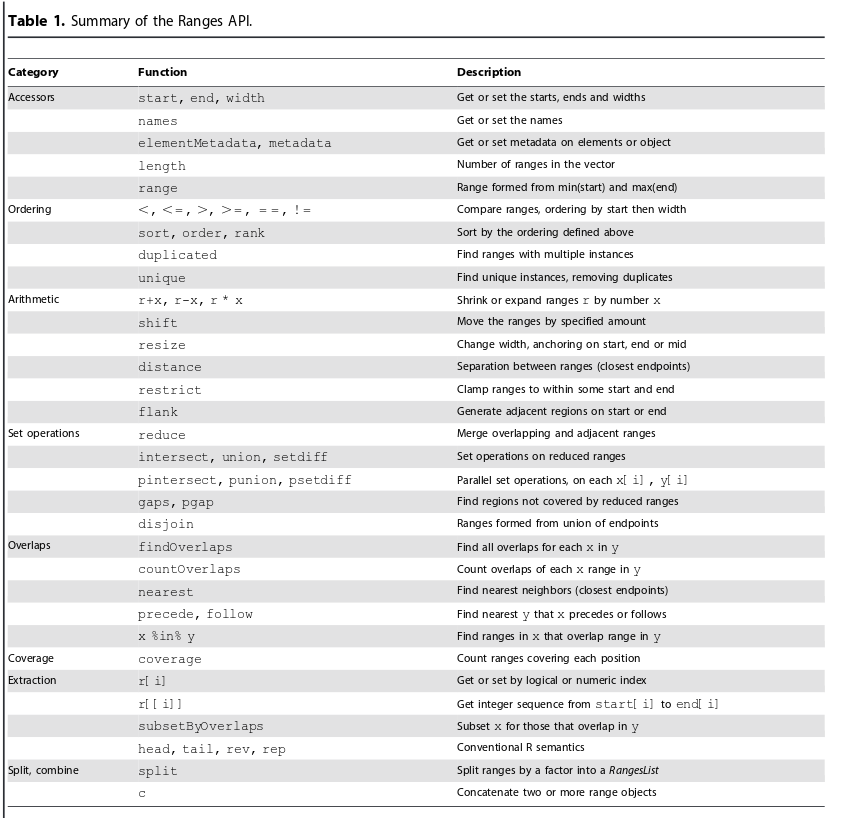

# Outline

- more file formats
- useful objects for dealing with genomic intervals
- overlapping set of regions
- exploring a `.bam` file using Bioconductor

# File formats for genomic intervals

We've already introduced several file formats:-

- `.fastq` for raw reads with qualities
- `.sam` for sequence alignments 
- `.bam` as compressed version of `.sam`

There are several more file formats designed to represent genomic features. It will be useful to introduce these before looking at how to access aligned reads in R.

- `.bed`
    + Genomic Intervals and information
- Wiggle / BedGraph
    + Genomic Intervals and scores
- GFF
    + Genomic annotation with information and scores

## bed format


<div id="BED3" align="center">
  
</div>  

- Simple format
- 3 tab-separated columns
- Chromosome, start, end
- Can be extended to `BED6`

<div id="BED3" align="center">
  
</div>  


- As before Chromosome, start, end
- Identifier
- Score
- Strand
    + or "." or strandless
    
## "Wiggle"

<div id="BED3" align="center">
  
</div>  

- Information line
    + chromosome
    + step size
- Step start position
- Score

## bedGraph


<div id="BED3" align="center">
  
</div>  

- Uses `BED3` format
- Chromosome, start, end
- 4th column in Score


## `.gff`

<div id="BED3" align="center">
  
</div>  

- Used to represent genome annotation
- Store position, feature (exon) and meta-feature (transcript / gene) information
- Columns 1, 4, 5,7
  + chromosome
  + start of feature
  + end of feature

- Columns 2, 3, 6
  + source
  + feature type
  + score
  
- Column 9
  + key-pairs separated by semi-colons (`;`)
  + ID - feature name
  + PARENT - meta-feature name
  

The files described above can all be loaded into IGV and genome browsers such as UCSC. However, they can be manipulated more efficiently if compressed and indexed

- wiggle / bedgraph -> bigWig (`.bw` / `.bigWig`)
- BED -> bigBed (`/bb`)
- BED and GFF -> `.gz` (zipped) and `.tbi` indexed

## More definitions here

- UCSC file formats
    + https://genome.ucsc.edu/FAQ/FAQformat.html
- IGV file formats
    + https://www.broadinstitute.org/igv/FileFormats
- Sanger (GFF)
    + https://www.sanger.ac.uk/resources/software/gff/spec.html


 
# <a name="bioc"></a> Processing with R and Bioconductor

We will now look at how we can represent and access genomic intervals in R and Bioconductor. We should note that these tools fit best within the framework of the course. There are tools outside of R that are extremely powerful; such as (***bedtools***)[http://bedtools.readthedocs.io/en/latest/] which are worth considering if you want to go further with NGS analysis.

## Genomic Intervals in Bioconductor

- The `IRanges` package in Bioconductor allows us to work with intervals
    + one of the aims of Bioconductor is to encourage core object-types and functions
    + `IRanges` is an example of this

`IRanges` is crucial for many packages. The [landing page](http://bioconductor.org/packages/release/bioc/html/IRanges.html) for the package lists just how many packages depend on it. If you want to find-out more, or look at the technical details, check out the [PLoS Computational Biology paper](http://journals.plos.org/ploscompbiol/article?id=10.1371/journal.pcbi.1003118).


## Example

Suppose we want to capture information on the following intervals

```{r echo=FALSE,message=FALSE,warning=FALSE}
library(GenomicRanges)
library(RColorBrewer)
library(ggbio)
ir <- IRanges(start = c(7,9,12,14,22:24), 
              end=c(15,11,13,18,26,27,28))
pl <- autoplot(ir,fill=brewer.pal(n=length(ir),"Set1"))+ geom_vline(xintercept = seq(1,40,by=1),lty=2)
library(gridExtra)
pl
```

- The `IRanges` function from the `IRanges` package is used to *construct* a new object
    + think `data.frame`, `vector` or `matrix` 
    + it's structure is quite unlike anything we've seen so far
    
```{r}
library(IRanges)
ir <- IRanges(
start = c(7,9,12,14,22:24), 
end=c(15,11,13,18,26,27,28))
str(ir)
```


- Typing the name of the object will print a summary of the object to the screen
    + useful compared to display methods for data frames, which print the whole object
- the square brackets `[]` should give a hint about how to access the data...

```{r}
ir
```


Additionally, we can give our ranges names
```{r}
ir <- IRanges(
start = c(7,9,12,14,22:24), 
end=c(15,11,13,18,26,27,28),names=LETTERS[1:7])
ir
```


- So `IRanges` can be treated as if they were *vectors*
    + no new rules to learn
        + if we can subset vectors, we can subset ranges
    + vector operations are efficient
    + Remember, square brackets `[` to subset
    + Inside the brackets, put a numeric vector to specify the `indices` that you want values for
        + e.g. get the first two intervals in the object using the `:` shortcut

```{r}
ir[1:2]
ir[c(2,4,6)]
```


- If we want to extract the properties of the object, the package authors have provided some useful functions
    + we call these *accessor* functions
    + We don't need to know the details of how the objects and implemented to access the data
    + the authors are free to change the implementation at any time
        + we shouldn't notice the difference
    + the result is a vector with the same length as the number of intervals
        
```{r}
start(ir)
end(ir)
width(ir)
```

## More-complex subsetting
- Recall that '*logical*' vectors can be used in subsetting
    + i.e. `TRUE` or `FALSE`
- Such a vector can be derived using a comparison operator
    + `<`, `>`, `==`
    
******
### Exercise
From the object we have just created:-

- What ranges have a width of 5?
- What ranges have a start position greater than 10
- What ranges have a start position greater than 10, and an end position less than 27?

******


## Manipulating Ranges

When it comes to manipulating intervals, lots of common use-cases are implemented



### Shifting
e.g. sliding windows

```{r echo=FALSE}
p2 <- autoplot(shift(ir,5),fill=brewer.pal(n=length(ir),"Set1")) +geom_vline(xintercept=seq(1,40,by=1),lty=2)
tracks(pl, p2)
```


```{r}
ir
shift(ir, 5)
```

The Size of shift doesn’t need to be constant

```{r echo=FALSE}
p2 <- autoplot(shift(ir,7:1),fill=brewer.pal(n=length(ir),"Set1"))+geom_vline(xintercept=seq(1,40,by=1),lty=2)
tracks(pl, p2)
```


```{r}
shift(ir, 7:1)
```


### Resize

e.g. trimming reads

```{r echo=FALSE}
p2 <- autoplot(resize(ir,3),fill=brewer.pal(n=length(ir),"Set1")) + geom_vline(xintercept=seq(1,40,by=1),lty=2)
tracks(pl, p2)
```

```{r}
resize(ir,3)
```


### Coverage

- Often we want to know how much sequencing we have at particular positions
    + i.e. depth of coverage

`coverage` returns a *Run Length Encoding* - an efficient representation of repeated values. At a whole-chromosome level, we have a large stretch of positions with the same coverage level. It would be rather inefficient to store the data in a vector. Although we can convert between `Rle`objects and vectors.

```{r}
cvg <- coverage(ir)
cvg
as.vector(cvg)
```

Often we might want to know what positions exceed a certain coverage level. This we can do using the `slice` function.

```{r}
slice(cvg,2)
```

## Overlapping

A large set of `IRanges` functionality is designed to deal with overlapping queries. Such operations are common in NGS analysis so we need to have an efficient way of performing them. You will probably come across such operations without even realising it.

- What reads overlap with a particular genomic region?
- What genes are affected by this particular copy-number loss / gain?
- How many variants are in exonic regions?
- For a given set of variants, what genes do they overlap with?
- How many variants does my gene of interest have?

The terminology of overlapping defines a *query* and a *subject*


- To illustrate lets start be defining a new set of ranges

```{r}
ir2 <- IRanges(start = c(1, 14, 27), end = c(13,
    18, 30),names=c("X","Y","Z"))
ir2
```


```{r echo=FALSE}
p2 <- autoplot(ir2)
tracks(pl,p2)

```


- The `findOverlaps` function can be used for overlap
    + the output isn't immediately obvious
    + length of output is the number of *hits*
        + each hit is defined by a subject and query index
    + require accessor functions to get the data; `queryHits` and `subjectHits`
    
```{r}
query <- ir
subject <- ir2
ov <- findOverlaps(query, subject)
ov
```

## queryHits and subjectHits

- `queryHits` returns *indices* from the ***query***
    + each query may overlap with many in the subject
```{r}
queryHits(ov)
```
- `subjectHits` returns *indices* from the ***subject***
    + each subject range may overlap with many in the query    
```{r}
subjectHits(ov)
```
- e.g. `r queryHits(ov)[1]` from the query overlaps with `r subjectHits(ov)[1]` from the subject

##Overlap example - First hit
    
    
```{r}
query[queryHits(ov)[1]]
subject[subjectHits(ov)[1]]
```

It is more common to use the `%over%` shortcut , which tells us (via a `TRUE` or `FALSE`) if every range in the query overlaps with the subject or not. The result can then be used for subset operations.

```{r}
ir %over% ir2
ir[ir %over% ir2]
```


- If we just wanted to count the number of overlaps for each range, we can use `countOverlaps`
    + result is a vector with length the number of intervals in query
    + e.g. interval 1 in the query overlaps with `r countOverlaps(query,subject)[1]` intervals in the subject
    
```{r}
countOverlaps(query,subject)

```

- The order of arguments is important

```{r}
countOverlaps(subject,query)
```

- Rather than counting, we might want to know which positions are in common
```{r}
intersect(ir,ir2)
```

- Or which positions are missing

```{r}
setdiff(ir,ir2)

```

So far the objects we have been dealing with have been located on the same arbitrary linear scale. When dealing with genomic data, we'll want to deal with intervals that are located on different chromosomes. The next object-type gives us a way of handling this.

## Introducing GRanges

- `GRanges` are a special kind of `IRanges` object used to manipulate genomic intervals in an efficient manner
- We can define a 'chromosome' for each range
    + referred to as seqnames
- we have the option to define a strand
- need to supply a ranges object, as we saw before
- operations on ranges respect the chromosome labels

```{r message=FALSE}
library(GenomicRanges)
gr <- GRanges(c("A","A","A","B","B","B","B"), ranges=ir)
gr
```

The object has gained a new variable `seqnames` which can be queried using the function `seqnames`.

```{r}
seqnames(gr)
table(seqnames(gr))
```


The operations we just described can also be applied to `GRanges` objects and it will respect the chromosome information

```{r}
resize(gr,4)
coverage(gr)

gr2 <- GRanges("A", ir2)
gr2
gr[gr %over% gr2]
```


The objects can be really powerful when we can add extra metadata

- `mcols` can be set to be a data frame with one row for each range
- Counts, gene names
    + anything you like!

```{r}
mcols(gr) <- data.frame(Count = runif(length(gr)), Gene =sample(LETTERS,length(gr)))
gr
```

The "counts" we have created here can be used in the subset operation

```{r}
gr[mcols(gr)$Count > 0.5]
```


- Creating an object to represent a particular gene is easy if we know its coordinates
    + we will look at representing the full gene structure later
        + e.g. exons, introns etc

```{r}
mygene <- GRanges("chr17", ranges=IRanges(7577851, 7598063))
mygene
```


## Importing ranges from a file

The `rtracklayer` package in Bioconductor supports then impot and export of many common file formats, including those we introduced at the start of the session.

```{r}
library(rtracklayer)
```

The `import` function can be used with a valid path to a connection (`con`), which can be a file stored locally, or online. Here we will load an example file that comes packaged with `rtracklayer`.

```{r}
bed.test <- import(con=paste(system.file("tests",package="rtracklayer"), "test.bed",sep="/"))
bed.test

gff.test <- import(con=paste(system.file("tests",package="rtracklayer"), "v1.gff",sep="/"))
gff.test
```


## Importing aligned data

We can import reads from a `.bam` file into Bioconductor. However, to set expectations, we should probably say we are not going to be processing the reads from a whole-genome sequencing run in this manner. This can be a useful way of diving-into a particular region of interest and exploring the data.

A package that can be used to parse a bam file is `GenomicAlignments`

```{r message=FALSE}
library(GenomicAlignments)
mybam <- readGAlignments("paired.bam")
mybam
```

You should see that the object created, `mybam` is displayed in a similar style to the `IRanges` and `GRanges` we have just been dealing with.

******
### Exercise

- How many reads are in this bam file?
- How many reads have aligned to each chromosome?

******

Once we have our reads in this form, we can start to play with some of the functions that we just learnt about. For example, a coverage vector is quite straightforward to obtain:-

```{r}
bamcov <- coverage(mybam)
bamcov
```

As we saw before, the coverage is calculated on each chromosome separately. To access the coverage for a particular chromosome we use the `$` operator.

```{r}
bamcov$"20"
```

******
### Exercise
- What is the mean coverage on chromosome 20? 
- What is the maximum? 
- How much of the chromosome has zero coverage?
- What regions are covered by more than 50 reads

******

## Overlapping genes with reads

Rather than looking at reads across the genome, we might be itching to look at that favourite gene of ours.

```{r}
mygene <- GRanges("chr17", ranges=IRanges(7577851, 7598063))
mygene
```

The `countOverlaps` function introduced earlier might be an ideal candidate for this kind of investigation.

```{r}
countOverlaps(mygene, mybam)
```

What is this this warning message telling us? It's basically saying that the sequence names are not compatible

```{r}
table(seqnames(mybam))
table(seqnames(mygene))
```


Before attempting an overlap between two different set of ranges, we need to make sure that their respective sequences names are compatible. One solution is to be more careful when creating our ranges.

```{r}
mygene <- GRanges("17", ranges=IRanges(7577851, 7598063))
countOverlaps(mygene, mybam)
```

The convenience function `seqlevelsStyle` has been written to help us understand what covention has been used to name the chromosomes, and can even rename where appropriate.

```{r}
mygene <- GRanges("chr17", ranges=IRanges(7577851, 7598063))
seqlevelsStyle(mygene)
seqlevelsStyle(mybam)
seqlevelsStyle(mygene) <- "NCBI"
countOverlaps(mygene, mybam)
```

If we want the actual reads themselves, we can use the `%over%` shortcut from earlier:-

```{r}
mybam[mybam %over% mygene]
```

Later we will revisit how to overlap reads with a particular gene of interest, as importing reads mapping to the entire genome and subsetting to our region of interest is not optimal

## Investigating mapping quality

For efficiency, the `readGAlignments` function imports a minimal amount of information from the file. From the specification of the `.sam `/ `.bam` file, there are many other useful pieces of information contained in the file. We can read more fields by making use of the `ScanBamParam` function. For instance, we might want to know the ID, sequence, mapping quality and "flag" for each read. We could do this in the following manner:-

```{r eval=FALSE}
bam <- readGAlignments("paired.bam",param=ScanBamParam(what=c("seq","mapq","flag")),use.names = TRUE)
bam
```

```{r echo=FALSE}
bam <- readGAlignments("paired.bam",param=ScanBamParam(what=c("seq","mapq","flag")),use.names = TRUE)
bam[1:3]
```


The command takes longer to run, but we get more detail on each of the reads. The extra fields make up the metadata for each reads and can be accessed using the `mcols` function that we met earlier. If we save this metadata as an object, we can treat it as a `data frame` and therefore have the usual `$` operator to access the columns

```{r}
meta <- mcols(bam)
meta
meta$seq
```

******
### Exercise

- What is the lowest mapping quality observed in the data?
- Produce a histogram of the mapping qualities
    + you should get something like...
    
```{r echo=FALSE}
hist(meta$mapq)
```

******

The exact definition of mapping quality will vary according to which aligner was used, or maybe even the version of the aligner. If we wish to impose such a threshold to do some filtering, we can do the following:-

```{r eval=FALSE}
toremove <- which(meta$mapq < 5)
length(toremove)
bam.filt <- bam[-toremove]
bam.filt
length(bam.filt) / length(bam)
```

```{r echo=FALSE}
toremove <- which(meta$mapq < 5)
length(toremove)
bam.filt <- bam[-toremove]
bam.filt
length(bam.filt) / length(bam)
```


Another field we might want to pay attention to is the `flag` of each read.


Depending on the kind of sequencing we have performed, we might be cautious about reads that are flagged as PCR or optical duplicates. Most downstream analysis tools will ignore these, but we rarely remove them altogether from the file.

The value of the flag is a combination of different quality indicators, so a PCR duplicate can be indicated by many different values. In our case, we don't have many different flags, so it is not too much work to identify all duplicates.

```{r}
table(meta$flag)
```

We can consult with the [explain flags](https://broadinstitute.github.io/picard/explain-flags.html) site to see which correspond to duplicates.

```{r eval=FALSE}
dups <- which(meta$flag %in% c(1107,1123,1171,1187))
length(dups)
```


Another option is to produce a convenient matrix which tabulates what flags have been set for each read. From this table we can identify the duplicates

```{r}
flagMat <- bamFlagAsBitMatrix(meta$flag)
dim(flagMat)
head(flagMat)
table(flagMat[,11])
```

N.B. These numbers should tally with the `samtools flagstat` output that we saw earlier.

If we wanted to ignore the duplicates from the start, we can infact tell `readGAlignments` to ignore them by making use of the `scanBamFlag` option

```{r eval=FALSE}
bam.nodups <- readGAlignments(file="paired.bam", param=ScanBamParam(flag=scanBamFlag(isDuplicate = FALSE)))
```

Another situation where we might want to focus on a subset of reads from the start, is when we want to analyse a particular gene. Provided that the `.bam` file has been indexed (creating a `.bam.bai` file in the same directory), we can *very* quickly jump to a particular genomic region. Notice that this (should) give the same number of reads as before when we did a `countOverlaps` operation.

```{r}
system.time(mygene.reads <- readGAlignments(file="paired.bam",param=ScanBamParam(which=mygene)))
mygene.reads
```

The region filer can be used in conjuction with the `what` argument to `ScanBamParam` function to provide a detailed picture of the reads for your gene

```{r eval=FALSE}
mygene.reads <- readGAlignments(file="paired.bam",param=ScanBamParam(which=mygene, what=c("seq","mapq","flag","qual","isize")))
mygene.reads
```

```{r echo=FALSE}
mygene.reads <- readGAlignments(file="paired.bam",param=ScanBamParam(which=mygene, what=c("seq","mapq","flag","qual","isize")))
mygene.reads[1:3]
```


## Pre-built databases of gene coordinates

Aside from the many useful software packages, Bioconductor also provides numerous annotation resources that we can utilise in our analysis. Firstly, we have a set of organism-level packages that can translate between different types of identifer. The package for humans is called `org.Hs.eg.db`. The advantage of such a package, rather than services such as biomaRt, is that we can do queries offline. The packages are updated every 6 months, so we can always be sure of what version of the relevant databases are being used.

```{r message=FALSE}
library(org.Hs.eg.db)
org.Hs.eg.db
```

There are several types of "key" we can use to make a query, and we have to specify one of these names. 

```{r}
keytypes(org.Hs.eg.db)
```

For the given keytype we have chosen, we can also choose what data we want to retrieve. We can think of these as columns in a table, and the pre-defined values are given by:-

```{r}
columns(org.Hs.eg.db)
```


For example, if we want to know the *"Entrez"* ID for the gene BRCA1, we can do:-

```{r}
eg <- select(org.Hs.eg.db, keys="BRCA1", keytype = "SYMBOL",columns = "ENTREZID")
eg
```

But we're not restricted to just one type of information to return

```{r}
eg <- select(org.Hs.eg.db, keys=c("BRCA1","PTEN"), keytype = "SYMBOL",columns = c("ENTREZID","ENSEMBL"))

```

You should see that the above command prints a message to the screen:- `'select()' returned 1:many mapping between keys and columns`. This is not an error message and R has still been able to generate the output requested. 

```{r}
eg
```

In this case, we have "many" (well, two) values of `ENSEMBL` for the gene `PTEN`. In practice this means we probably want to think carefully about merging this data with other tables.


You might expect to be able to retrieve information about the coordinates for a particular gene using the same interface. This was supported until recently, but the recommended approach now is to use another class of packages which describe the structure of genes in more detail. 

The packages with the prefix `TxDb....` represent the structure of all genes for a given organism in an efficient manner. For humans, we can use the package `TxDb.Hsapiens.UCSC.hg19.knownGene` to tell us about transcripts for the `hg19` build of the genome. The package was generated using tables from the [UCSC genome browser](https://www.genome.ucsc.edu/)

As with the `org.Hs.eg.db` package we can load the package and inspect the kind of mappings available to us.

```{r message=FALSE}
library(TxDb.Hsapiens.UCSC.hg19.knownGene)
txdb <- TxDb.Hsapiens.UCSC.hg19.knownGene
columns(txdb)
keytypes(txdb)
```

You'll see that all the mappings are regarding the coordinates and IDs of various genomic features. There is only one type of identifier used, in this case `Entrez ID`. If we know a genes Entrez ID, we can get the exon coordinates with the following query.

```{r}
mygene <- select(txdb, keys="672", columns = c("EXONCHROM","EXONSTART","EXONEND","EXONSTRAND"),keytype="GENEID")
mygene
```


******
### Exercise

- Using the results from the previous exercise, retrieve the exon coordinates for the gene `PTEN`
- How about all transcripts for PTEN and BRCA1?

******

It is useful to be able to retrive the coordinates in this manner. However, we should now be familiar with the way intervals can be represented using `GRanges`. We have the ability to create a `GRanges` object from the result:- 

```{r}
my.gr <- GRanges(mygene$EXONCHROM, IRanges(mygene$EXONSTART,mygene$EXONEND))
my.gr
```


A powerful feature of the transcript database packages is to allow the user to create a `GRanges` representation of *all* exons / transcripts for a particular organism. The function to do this is `exonsBy` (or equivalently `transcriptsBy`). The result is a *list* object that can be subset according to Entrez ID. 

```{r}
allex <- exonsBy(txdb, "gene")
mygene <- allex[["672"]]
mygene
```

We are almost in a position to overlap our reads with the `GRanges` representation of our gene. First of all, we need the same trick from before to make sure the chromosome names are compatible

```{r}
seqlevelsStyle(mybam)
seqlevelsStyle(mygene)
seqlevelsStyle(mygene) <- "Ensembl"
mygene
```

Furthermore, since we know we are only interested in the reads from chromosome 17, we could subset the reads accordingly.


```{r}
mybam.chr17 <- keepSeqlevels(mybam, "17")
```

```{r}
mybam.chr17[mybam.chr17 %over% mygene]
```

NOTE:- it also seems that the Mitochondial sequence is a different length in the reference that these reads were aligned to, compared to the transcript database. It may seem like a trivial difference, but will cause an error if we don't perform the subset to just chromosome 17.

```{}
Error in mergeNamedAtomicVectors(seqlengths(x), seqlengths(y), what = c("sequence",  : 
  sequence MT has incompatible seqlengths:
  - in 'x': 16569
  - in 'y': 16571
```

Per-exon counts can be achieved using the `countOverlaps` function:-

```{r}
countOverlaps(mygene,mybam.chr17)
```

And finally, we should note that we could subset just the reads for this gene with the following set of commands. The only thing we need to know in advance is the Entrez ID of our gene.

```{r}
library(TxDb.Hsapiens.UCSC.hg19.knownGene)
txdb <- TxDb.Hsapiens.UCSC.hg19.knownGene
allex <- exonsBy(txdb, "gene")
mygene <- allex[["672"]]
seqlevelsStyle(mygene) <- "Ensembl"
mygene <- keepSeqlevels(mygene,"17")
reads <- readGAlignments("paired.bam",param=ScanBamParam(which=mygene))
```

A final note is that we can also export any ranges we have created to a file (e.g. a `.bed` file) for further processing or visualisation in IGV.

```{r}
export(mygene, con="mygene.bed")
```


# Summary

We have explored the properties of bam files using Bioconductor. The techniques and types of object we have learnt about will crop-up again-and-again in the course. The vast majority of NGS analysis tools in Bioconductor will use `GenomicRanges` and `TxDb` objects in some form. 

Due to the high-volume of the dataset, some of the tools and pipelines we use will not be in R. However, you will still be able to interrogate the results you obtain and explore them in more detail using R.


******
### Exercise (Optional)

- Find the locations of all exons on chromosome 22
- Create a subset of reads that align to chromosome 22
    + make sure the sequence names are in the same format
- What propotion of reads are located outside of exons?
- Do we have any regions with unusually-high coverage?

```{r echo=FALSE}
ex.22 <- exons(txdb)
ex.22 <- keepSeqlevels(ex.22, "chr22")
seqlevelsStyle(ex.22) <- "Ensembl"
```

```{r}
reads.chr22 <- readGAlignments("paired.bam",param=ScanBamParam(which=GRanges("22", IRanges(1, 51304566))))
reads.exonic <- reads.chr22[reads.chr22 %over% ex.22]
reads.nonex <- reads.chr22[!reads.chr22 %over% ex.22]
length(reads.nonex) / length(reads.chr22) 
```

