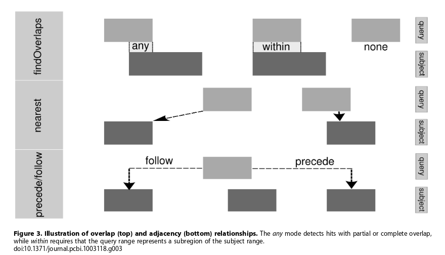

# Outline

- introducing the `.bed` format
- exploring a `.bam` file using Bioconductor
- useful objects for dealing with genomic intervals
- overlapping set of regions

# File formats for genomic intervals

We've already introduced several file formats:-

- `.fastq` for raw reads with qualities
- `.sam` for sequence alignments 
- `.bam` as compressed version of `.sam`

There are several more file formats designed to represent genomic features. It will be useful to introduce these before looking at how to access aligned reads in R.

- `.bed`

<div id="BED3" align="center">
  
</div>  

- Simple format
- 3 tab-separated columns
- Chromosome, start, end
- Can be extended to `BED6`

<div id="BED3" align="center">
  
</div>  


- As before Chromosome, start, end
- Identifier
- Score
- Strand
    + or "." or strandless
    

## More definitions here

- UCSC file formats
    + https://genome.ucsc.edu/FAQ/FAQformat.html
- IGV file formats
    + https://www.broadinstitute.org/igv/FileFormats
- Sanger (GFF)
    + https://www.sanger.ac.uk/resources/software/gff/spec.html


 
# <a name="bioc"></a> Processing with R and Bioconductor

We will now look at how we can represent and access genomic intervals in R and Bioconducto which fit best within the framework of the course. There are also tools outside of R that are extremely powerful; such as [***bedtools***](http://bedtools.readthedocs.io/en/latest/) which are worth considering if you want to go further with NGS analysis.


## Importing aligned data

We can import reads from a `.bam` file into Bioconductor. However, to set expectations we are not going to be processing the entire set of reads from a whole-genome sequencing run in this manner. This can be a useful way of diving-into a particular region of interest and exploring the data.

A package that can be used to parse a `.bam` file is `GenomicAlignments`. You should notice that although the `.bam` file is not particularly big (~ 12.5 Million reads), but already takes a little while to read.

```{r message=FALSE}
library(GenomicAlignments)
mybam <- readGAlignments("paired.bam")
mybam
```


Similar to the importing the `.fastq` files using `ShortRead`, `readGAlignments` has provided us with an object that can be manipulated using the standard vector conventions. 

```{r}
mybam[1:10]
```

There are also a number of *accessor* functions that can get particular items from the object; `cigar` to obtain the CIGAR strings, `start` / `end` to get the start and end positions, `width` to get the width of each read.


******
### Exercise

- How many reads have an exact match to the genome
    + what cigar string would this be?
- What proportion of all reads is this?

******

The chromosome that each read is aligned to can be obtained using the `seqnames` function. Unlike the functions we have just introduced, that return a vector, `seqnames` gives a result in a slightly different form

```{r}
chrs <- seqnames(mybam)
chrs
```

This `Rle` object is a way of representing vectors with lots of repetition; rather than repeating the value `1` 1222361 times, we represent this as a *run* of 1 with length 1222361. Fortunately, many functions will treat the output of `seqnames` as if it were a regular vector.

```{r}
table(chrs)
```

This type of object is also created when we compute the *coverage* of a particular region. Using the `coverage` function we get an `Rle` object for each chromosome. We can access the coverage for a particular chromosome by putting the chromosome name inside double square brackets `[[]]`. This is the usual way of accessing items in a list in R, which you might have come across.

```{r}
bamcov <- coverage(mybam)
bamcov
bamcov[["1"]]
```

Do we have any regions on Chromosome 1 with more than 400 reads? We can do this using `slice`.

```{r}
slice(bamcov[["1"]],400)
```


Rather than taking a whole-genome view, we often want to view the reads for a particular gene or region of interest. This we can do using the functions we have already seen.

```{r}
my.reads <- which(seqnames(mybam)=="17" & start(mybam) > 7577851 & end(mybam) < 7598063)
mybam[my.reads]
```

However, there are much more efficient ways to do such queries in Bioconductor. First of all, we need to understand a bit more about how the data are being represented.

`GenomicAlignments` is part of a family of packages that provide object-types and functionality for dealing with genomic intervals; which are described in a [PLoS Computational Biology paper](http://journals.plos.org/ploscompbiol/article?id=10.1371/journal.pcbi.1003118) from 2013. 

The basic type of interval we can define is an `IRanges` object

```{r}
ir <- IRanges(
start = c(7,9,12,14,22:24), 
end=c(15,11,13,18,26,27,28))
ir
```

There is an extensive list of operations that we can perform on this object


To start using these operations in a genome context, we can create a `GRanges` object. This has all the same information as an `IRanges` object with extra capability to store the sequence name, strand and other (optional) metadata.

```{r}
mygene <- GRanges("chr17", ranges=IRanges(7577851, 7598063),strand="+")
mygene
```


A large set of `IRanges` functionality is designed to deal with overlapping queries. Such operations are common in NGS analysis so we need to have an efficient way of performing them. You will probably come across such operations without even realising it.

- What reads overlap with a particular genomic region?
- What genes are affected by this particular copy-number loss / gain?
- How many variants are in exonic regions?
- For a given set of variants, what genes do they overlap with?
- How many variants does my gene of interest have?

The terminology of overlapping defines a *query* and a *subject*


The `countOverlaps` function is be an ideal candidate for this kind of investigation.

```{r}
countOverlaps(mygene, mybam)
```

What is this this warning message telling us? It's basically saying that the sequence names are not compatible. A major annonyance of dealing with NGS data is the way that different databases represent a relatively trivial piece of information such as chromosome name.

```{r}
table(seqnames(mybam))
table(seqnames(mygene))
```


So before attempting an overlap between two different set of ranges, we need to make sure that their respective sequences names are compatible. One solution is to be more careful when creating our ranges.

```{r}
mygene <- GRanges("17", ranges=IRanges(7577851, 7598063))
countOverlaps(mygene, mybam)
```

The convenience function `seqlevelsStyle` has been written to help us understand what covention has been used to name the chromosomes, and can even rename where appropriate.

```{r}
mygene <- GRanges("chr17", ranges=IRanges(7577851, 7598063))
seqlevelsStyle(mygene)
seqlevelsStyle(mybam)
seqlevelsStyle(mygene) <- "NCBI"
countOverlaps(mygene, mybam)
```

If we want the actual reads themselves, we can use a convenient `%over%` shortcut

```{r}
mybam[mybam %over% mygene]
```

Later we will revisit how to overlap reads with a particular gene of interest, as importing reads mapping to the entire genome and subsetting to our region of interest is not optimal

## Investigating mapping quality

For efficiency, the `readGAlignments` function imports a minimal amount of information from the file. From the specification of the `.sam `/ `.bam` file, there are many other useful pieces of information contained in the file. We can read more fields by making use of the `ScanBamParam` function. For instance, we might want to know the ID, sequence, mapping quality and "flag" for each read. We could do this in the following manner:-

```{r eval=FALSE}
bam <- readGAlignments("paired.bam",param=ScanBamParam(what=c("seq","mapq","flag")))
bam
```

```{r echo=FALSE}
bam <- readGAlignments("paired.bam",param=ScanBamParam(what=c("seq","mapq","flag")))
bam[1:3]
```


The command takes longer to run, but we get more detail on each of the reads. The extra fields make up the *metadata* for each read and can be accessed using the `mcols` function. If we save this metadata as an object, we can treat it as a `data frame` and therefore have the usual `$` operator to access the columns

```{r}
meta <- mcols(bam)
meta
meta$seq
```

******
### Exercise

- What is the lowest mapping quality observed in the data?
- Produce a histogram of the mapping qualities
    + you should get something like...
    
```{r echo=FALSE}
hist(meta$mapq)
```

******

The exact definition of mapping quality will vary according to which aligner was used, or maybe even the version of the aligner. If we wish to impose such a threshold to do some filtering, we can do the following:-

```{r eval=FALSE}
toremove <- which(meta$mapq < 5)
length(toremove)
bam.filt <- bam[-toremove]
bam.filt
length(bam.filt) / length(bam)
```

```{r echo=FALSE}
toremove <- which(meta$mapq < 5)
length(toremove)
bam.filt <- bam[-toremove]
bam.filt
length(bam.filt) / length(bam)
```


Another field we might want to pay attention to is the `flag` of each read.


Depending on the kind of sequencing we have performed, we might be cautious about reads that are flagged as PCR or optical duplicates. Most downstream analysis tools will ignore these, but we rarely remove them altogether from the file.

The value of the flag is a combination of different quality indicators, so a PCR duplicate can be indicated by many different values. In our case, we don't have many different flags, so it is not too much work to identify all duplicates.

```{r}
table(meta$flag)
```

We can consult with the [explain flags](https://broadinstitute.github.io/picard/explain-flags.html) site to see which correspond to duplicates.

```{r eval=FALSE}
dups <- which(meta$flag %in% c(1107,1123,1171,1187))
length(dups)
```


Another option is to produce a convenient matrix which tabulates what flags have been set for each read. From this table we can identify the duplicates

```{r}
flagMat <- bamFlagAsBitMatrix(meta$flag)
dim(flagMat)
head(flagMat)
table(flagMat[,11])
```

N.B. These numbers should tally with the `samtools flagstat` output that we saw earlier.

If we wanted to ignore the duplicates from the start, we can infact tell `readGAlignments` to ignore them by making use of the `scanBamFlag` option

```{r eval=FALSE}
bam.nodups <- readGAlignments(file="paired.bam", param=ScanBamParam(flag=scanBamFlag(isDuplicate = FALSE)))
```

Another situation where we might want to focus on a subset of reads from the start, is when we want to analyse a particular gene. Provided that the `.bam` file has been indexed (creating a `.bam.bai` file in the same directory), we can *very* quickly jump to a particular genomic region. Notice that this (should) give the same number of reads as before when we did a `countOverlaps` operation.

```{r}
system.time(mygene.reads <- readGAlignments(file="paired.bam",param=ScanBamParam(which=mygene)))
mygene.reads
```

The region filer can be used in conjuction with the `what` argument to `ScanBamParam` function to provide a detailed picture of the reads for your gene

```{r eval=FALSE}
mygene.reads <- readGAlignments(file="paired.bam",param=ScanBamParam(which=mygene, what=c("seq","mapq","flag","qual","isize")))
mygene.reads
```

```{r echo=FALSE}
mygene.reads <- readGAlignments(file="paired.bam",param=ScanBamParam(which=mygene, what=c("seq","mapq","flag","qual","isize")))
mygene.reads[1:3]
```


## Pre-built databases of gene coordinates

Aside from the many useful software packages, Bioconductor also provides numerous annotation resources that we can utilise in our analysis. Firstly, we have a set of organism-level packages that can translate between different types of identifer. The package for humans is called `org.Hs.eg.db`. The advantage of such a package, rather than services such as biomaRt, is that we can do queries offline. The packages are updated every 6 months, so we can always be sure of what version of the relevant databases are being used.

```{r message=FALSE}
library(org.Hs.eg.db)
org.Hs.eg.db
```

There are several types of "key" we can use to make a query, and we have to specify one of these names. 

```{r message=FALSE}
keytypes(org.Hs.eg.db)
```

For the given keytype we have chosen, we can also choose what data we want to retrieve. We can think of these as columns in a table, and the pre-defined values are given by:-

```{r}
columns(org.Hs.eg.db)
```


For example, if we want to know the *"Entrez"* ID for the gene BRCA1, we can do:-

```{r message=FALSE}
eg <- select(org.Hs.eg.db, keys="BRCA1", keytype = "SYMBOL",columns = "ENTREZID")
eg
```

But we're not restricted to just one type of information to return

```{r}
eg <- select(org.Hs.eg.db, keys=c("BRCA1","PTEN"), keytype = "SYMBOL",columns = c("ENTREZID","ENSEMBL"))

```

You should see that the above command prints a message to the screen:- `'select()' returned 1:many mapping between keys and columns`. This is not an error message and R has still been able to generate the output requested. 

```{r}
eg
```

In this case, we have "many" (well, two) values of `ENSEMBL` for the gene `PTEN`. In practice this means we probably want to think carefully about merging this data with other tables.


You might expect to be able to retrieve information about the coordinates for a particular gene using the same interface. This was supported until recently, but the recommended approach now is to use another class of packages which describe the structure of genes in more detail. 

The packages with the prefix `TxDb....` represent the structure of all genes for a given organism in an efficient manner. For humans, we can use the package `TxDb.Hsapiens.UCSC.hg19.knownGene` to tell us about transcripts for the `hg19` build of the genome. The package was generated using tables from the [UCSC genome browser](https://www.genome.ucsc.edu/)

As with the `org.Hs.eg.db` package we can load the package and inspect the kind of mappings available to us.

```{r message=FALSE}
library(TxDb.Hsapiens.UCSC.hg19.knownGene)
txdb <- TxDb.Hsapiens.UCSC.hg19.knownGene
columns(txdb)
keytypes(txdb)
```

You'll see that all the mappings are regarding the coordinates and IDs of various genomic features. There is only one type of identifier used, in this case `Entrez ID`. If we know a genes Entrez ID, we can get the exon coordinates with the following query.

```{r message=FALSE}
mygene <- select(txdb, keys="672", columns = c("EXONCHROM","EXONSTART","EXONEND","EXONSTRAND"),keytype="GENEID")
mygene
```


******
### Exercise

- Using the results from the previous exercise, retrieve the exon coordinates for the gene `PTEN`
- How about all transcripts for PTEN and BRCA1?

******

It is useful to be able to retrive the coordinates in this manner. However, we should now be familiar with the way intervals can be represented using `GRanges`. We have the ability to create a `GRanges` object from the result:- 

```{r}
my.gr <- GRanges(mygene$EXONCHROM, IRanges(mygene$EXONSTART,mygene$EXONEND))
my.gr
```


A powerful feature of the transcript database packages is to allow the user to create a `GRanges` representation of *all* exons / transcripts for a particular organism. The function to do this is `exonsBy` (or equivalently `transcriptsBy`). The result is a *list* object that can be subset according to Entrez ID. 

```{r message=FALSE}
allex <- exonsBy(txdb, "gene")
mygene <- allex[["672"]]
mygene
```

We are almost in a position to overlap our reads with the `GRanges` representation of our gene. First of all, we need the same trick from before to make sure the chromosome names are compatible

```{r}
seqlevelsStyle(mybam)
seqlevelsStyle(mygene)
seqlevelsStyle(mygene) <- "Ensembl"
mygene
```

Furthermore, since we know we are only interested in the reads from chromosome 17, we could subset the reads accordingly.


```{r}
mybam.chr17 <- keepSeqlevels(mybam, "17")
```

```{r message=FALSE}
mybam.chr17[mybam.chr17 %over% mygene]
```

NOTE:- it also seems that the Mitochondial sequence is a different length in the reference that these reads were aligned to, compared to the transcript database. It may seem like a trivial difference, but will cause an error if we don't perform the subset to just chromosome 17.

```{}
Error in mergeNamedAtomicVectors(seqlengths(x), seqlengths(y), what = c("sequence",  : 
  sequence MT has incompatible seqlengths:
  - in 'x': 16569
  - in 'y': 16571
```

Per-exon counts can be achieved using the `countOverlaps` function:-

```{r}
countOverlaps(mygene,mybam.chr17)
```

And finally, we should note that we could subset just the reads for this gene with the following set of commands. The only thing we need to know in advance is the Entrez ID of our gene.

```{r message=FALSE}
library(TxDb.Hsapiens.UCSC.hg19.knownGene)
txdb <- TxDb.Hsapiens.UCSC.hg19.knownGene
allex <- exonsBy(txdb, "gene")
mygene <- allex[["672"]]
seqlevelsStyle(mygene) <- "Ensembl"
mygene <- keepSeqlevels(mygene,"17")
reads <- readGAlignments("paired.bam",param=ScanBamParam(which=mygene))
```

A final note is that we can also export any ranges we have created to a file (e.g. a `.bed` file) for further processing or visualisation in IGV.

```{r}
library(rtracklayer)
export(mygene, con="mygene.bed")
```


# Summary

We have explored the properties of bam files using Bioconductor. The techniques and types of object we have learnt about will crop-up again-and-again in the course. The vast majority of NGS analysis tools in Bioconductor will use `GenomicRanges` and `TxDb` objects in some form. 

Due to the high-volume of the dataset, some of the tools and pipelines we use will not be in R. However, you will still be able to interrogate the results you obtain and explore them in more detail using R.


******
### Exercise (Optional)

- Find the locations of all exons on chromosome 22
- Create a subset of reads that align to chromosome 22
    + make sure the sequence names are in the same format
- What propotion of reads are located outside of exons?
- Do we have any regions with unusually-high coverage?

```{r echo=FALSE}
ex.22 <- exons(txdb)
ex.22 <- keepSeqlevels(ex.22, "chr22")
seqlevelsStyle(ex.22) <- "Ensembl"
```

```{r}
reads.chr22 <- readGAlignments("paired.bam",param=ScanBamParam(which=GRanges("22", IRanges(1, 51304566))))
reads.exonic <- reads.chr22[reads.chr22 %over% ex.22]
reads.nonex <- reads.chr22[!reads.chr22 %over% ex.22]
length(reads.nonex) / length(reads.chr22) 
```
